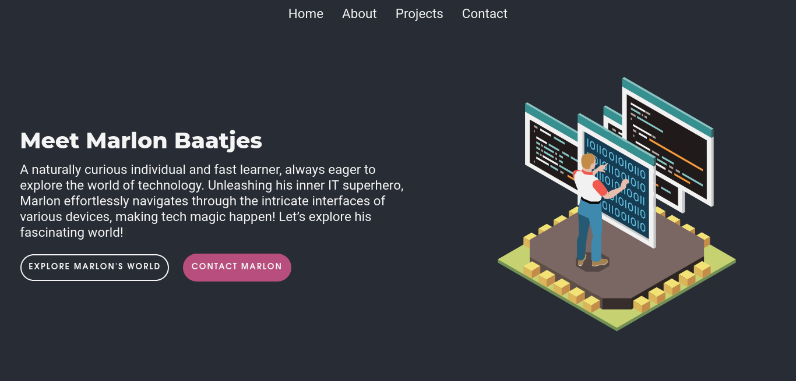

# Portfolio Website with Next.js and SCSS



This repository contains the code for my personal portfolio website, built using Next.js and styled with SCSS. The website showcases my skills, projects, and provides a unique touch with typewriter effect and text-to-speech API for introducing myself.

## Technologies Used

- Next.js: Next.js is a powerful React framework that provides built-in support for routing and performance optimizations, making it an excellent choice for building modern web applications.
- SCSS: SCSS (Sass) is used to write robust, maintainable CSS with features like variables, nesting, and mixins, which streamline the styling process and enhance code organization.
- EmailJS: The EmailJS library is integrated to enable visitors to contact me directly through email, making it convenient for potential employers or collaborators to get in touch.
- Typewriter Effect: The typewriter effect is implemented to create a visually appealing introduction on the website, engaging visitors and providing a unique user experience.
- Text-to-Speech API: Leveraging the text-to-speech API, the portfolio offers an innovative way for users to interact with the content and adds an extra layer of accessibility to the website.

## Features

- **About Me:** A brief introduction of myself and my background and a list of my skills.
- **Projects:** A showcase of my personal and professional projects, each with its description and link to the live demo or repository.
- **Contact:** A contact form powered by EmailJS, allowing visitors to reach out to me directly through email.

## Installation

1. Clone the repository:

```bash
git clone https://github.com/mdesignscode/marlonbaatjes.git
```

2. Navigate to the project directory:

```bash
cd marlonbaatjes
```

3. Install the dependencies:

```bash
npm install
```

4. Run the development server:

```bash
npm run dev
```

5. Open your browser and visit `http://localhost:3000` to view the portfolio website locally.

## Configuration

To use the EmailJS functionality, you need to set up your EmailJS account and configure the necessary parameters. Follow these steps:

1. Sign up for an account on [EmailJS](https://www.emailjs.com/).
2. Create an email template with placeholders for the sender's name, email, and message.
3. Obtain your EmailJS User ID.
4. Create a file called `.env` and add the following:

```.env
NEXT_PUBLIC_EMAILJS_USER_ID=your_user_id
NEXT_PUBLIC_EMAILJS_SERVICE_ID=your_service_id
NEXT_PUBLIC_EMAILJS_TEMPLATE_ID=your_template_id
```

## Customization

Feel free to customize this portfolio template to make it your own:

- Update the content in the `app` directory to reflect your personal information, skills, and projects.
- Modify the SCSS files in the `app/styles` directory to change the website's visual appearance and layout.
- Add or remove components and pages as per your requirements.

## Deployment

To deploy your portfolio website, you can use platforms like Vercel, Netlify, or GitHub Pages, which support Next.js applications.

1. Create an account on your preferred hosting platform.
2. Link your GitHub repository to the hosting platform.
3. Configure the deployment settings (e.g., build commands, environment variables).
4. Deploy the application using the provided deployment options.

## Feedback and Contributions

Feedback and contributions are welcome! If you have suggestions to improve this portfolio or found a bug, please open an issue or submit a pull request.

---

Thank you for visiting my repository! I hope you enjoy exploring my portfolio website. If you have any questions or would like to get in touch, feel free to contact me through the provided contact form.

*Happy coding!*
